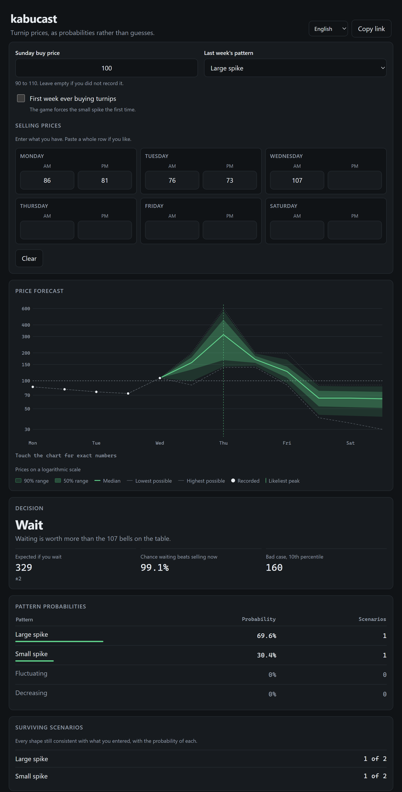

# kabucast

[](https://github.com/joyboyisalive07-lab/kabucast/actions/workflows/ci.yml)
[](LICENSE)

A turnip price predictor for Animal Crossing: New Horizons. You type the Sunday
buy price and whatever half-day prices you have. It gives you the probability of
each price pattern, the range each remaining half-day can still take, and a
decision about when to sell.

**[Open it](https://joyboyisalive07-lab.github.io/kabucast/)** ·
[Русская версия этого файла](README.ru.md)



## Try this first

Open [this link](https://joyboyisalive07-lab.github.io/kabucast/#b=100&p=88.84.80.76.72.71).
Sunday 100, then 88, 84, 80, 76, 72, 71.

kabucast says the prices cannot happen. It is right. A fall from 72 to 71 is a
rate step of 0.01, the smallest step any decreasing phase in the game takes is
0.03, and 71 is too low to be a high-phase slot or a spike. No pattern, no phase
assignment and no base price produces that sequence. Somebody typed 71 instead
of 61.

Now open [the same numbers in Turnip Prophet](https://turnipprophet.io/?prices=100.88.84.80.76.72.71).
It reports 65.7% decreasing, 31.4% large spike, 2.88% small spike. It reaches
those by widening the accepted price by up to five whole bells and clamping the
observation into whatever range it predicted. Nothing on screen says so.

A number that arrives after your data has been altered to fit is not a
probability of anything. When kabucast cannot compute, it says it cannot
compute.

## Where the two tools agree

This matters more than the disagreement, and it is usually reported wrongly.

Turnip Prophet does **not** treat consecutive prices inside a falling phase as
independent, and it does not merely count surviving branches. Its `PDF` class
carries the rate density through the decay chain and conditions on each
observation, which is the correct factorisation. On every reachable input
tested, the two tools agree to the three significant figures it displays —
including the number of surviving scenarios and each scenario's individual
probability.

| Input, Sunday price 100 | kabucast | Turnip Prophet |
| --- | --- | --- |
| `88.84.80.76` | large 46.82%, decreasing 48.89%, small 4.29% | large 46.8%, decreasing 48.9%, small 4.29% |
| `86.81.76.73.107` | large 91.61%, small 8.39% | large 91.6%, small 8.39% |
| `75.70.66` | fluctuating 4.075%, small 95.925% | fluctuating 4.08%, small 95.9% |
| `88.84.80.76.72.71` | **cannot happen** | decreasing 65.7%, large 31.4%, small 2.88% |

The working is in [docs/CALIBRATION.md](docs/CALIBRATION.md).

## What is actually different

**The probabilities are measures, not counts.** An observed price is an integer;
the rate behind it is not. Each price pins the rate to an interval one bell
wide, so a scenario's probability is the volume of the region of rate space
consistent with everything you typed. Inside a falling phase each rate is the
previous one minus an independent uniform decrement, so that region is a convex
polytope in up to twelve dimensions. kabucast computes its volume exactly, in
closed form, by carrying the rate density forward as a piecewise polynomial.
Turnip Prophet approximates the same density on a grid of 1e-4 rate units. At
three significant figures the difference does not show, which is worth saying
plainly.

**An impossible input is reported, not repaired.** No fudge factor, no clamping.

**It decides when to sell.** Turnip Prophet reports prices; that is all. kabucast
runs the stopping problem backwards over price paths drawn from the posterior
and tells you the expected bells from waiting, the chance that waiting beats the
price in front of you, and the tenth percentile if it goes badly. That part is a
Monte Carlo approximation, it is labelled as one, and it carries its standard
error — around two bells early in the week and under one by midweek. The rule is
fitted on one sample and valued on an independent one, so the figure quoted is
what a policy you could actually follow is worth.

**Nothing you type leaves your machine.** The whole calculation runs in the page.
The permalink puts your input after the `#`, which browsers do not send to the
server.

## How well it works

One million simulated weeks, sixteen million predictions, eight checkpoints
through the week, with last week's pattern both told to the predictor and
withheld. Reproduce it with `node tools/simulate.ts --weeks 1000000`; the seed
is fixed and the run is byte-reproducible.


When kabucast says 77%, the pattern is that one about 77% of the time. With last
week's pattern known, no probability bin is off by more than 0.0021, and the
largest deviation is two standard errors. Over eight checkpoints the worst
near-certain accuracy is 99.978%: when it claims 99% or better, it is wrong
about twenty-two weeks in a hundred thousand.

How much of the week has to pass before the answer settles:

| Prices entered | Resolved to a single pattern | Mean probability on the truth |
| --- | ---: | ---: |
| Monday, both halves | 20.8% | 0.746 |
| Tuesday, both halves | 62.3% | 0.847 |
| Wednesday, both halves | 73.3% | 0.903 |
| Thursday, both halves | 96.0% | 0.994 |

A quarter of weeks are still genuinely ambiguous on Wednesday evening. kabucast
shows those as several surviving scenarios with their weights instead of picking
one, which is the whole point.

## Using it

**In a browser.** <https://joyboyisalive07-lab.github.io/kabucast/> — works
offline after the first visit.

**As one file.** Download `kabucast-offline.html` from the
[latest release](https://github.com/joyboyisalive07-lab/kabucast/releases/latest).
It is about 76 KB, contains everything, and opens from your filesystem with no
server and no network.

**As a program.** Download `kabucast.exe` from the same release and run it. It
carries the page inside itself and opens it in your default browser.

Enter prices as you learn them. Focus moves on by itself, and you can paste a
whole row at once. The link in the address bar always holds your current input,
so the copy button gives you something you can send to someone.

Seven languages: English, Russian, German, Spanish, French, Japanese, Simplified
Chinese.

## Building from source

Node 22.18 or newer. Two development dependencies, `typescript` and `esbuild`,
and no runtime dependencies at all.

```bash
npm ci
npm run typecheck
npm test
npm run build
```

`dist/` then holds the site, `kabucast-offline.html` and `kabucast.ico`. The
executable needs Python with PyInstaller:

```bash
python -m PyInstaller --onefile --noconsole --name kabucast --icon dist/kabucast.ico --add-data "dist/kabucast-offline.html;." --distpath dist --workpath build/pyinstaller --specpath build tools/kabucast_launcher.py
```

The screenshots above were taken from the real interface with headless Chrome
against the local build; the calibration plot is drawn by `node tools/plot.ts`
from `docs/calibration.json`, which is the output of the simulation run and is
committed alongside it.

## Where the algorithm comes from

The game's price algorithm was extracted from the binary by
[Ash Wolf (Ninji)](https://wuffs.org/projects/acnh) and published as
[a decompilation](https://gist.github.com/Treeki/85be14d297c80c8b3c0a76375743325b).
Every constant kabucast uses is traced to a line of that source in
[docs/ALGORITHM.md](docs/ALGORITHM.md), and each was confirmed against the
independent transcription in
[Turnip Prophet](https://github.com/mikebryant/ac-nh-turnip-prices) by Mike
Bryant and contributors. No code was copied from either; the model was
reimplemented from the specification.

Both are readings of one extraction from one binary, so their agreement rules
out a transcription error and nothing more. That limit is stated in the
documentation rather than glossed over.

## Documentation

- [docs/ALGORITHM.md](docs/ALGORITHM.md) — the model, every constant with its source, and the derivations.
- [docs/CALIBRATION.md](docs/CALIBRATION.md) — the simulation results and the comparison, in full.
- [docs/DECISIONS.md](docs/DECISIONS.md) — every non-obvious choice, with what was rejected and why.

## Non-affiliation

kabucast is an independent project. It is not affiliated with, endorsed by, or
sponsored by Nintendo. Animal Crossing is a trademark of Nintendo. This
repository contains no assets from the game.

## License

MIT, copyright joyboyisalive07-lab. See [LICENSE](LICENSE).
