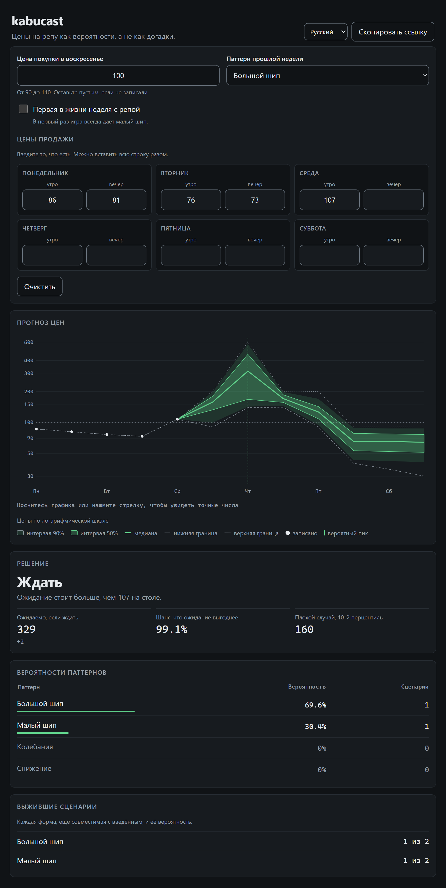
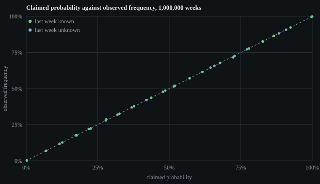

# kabucast

[](https://github.com/joyboyisalive07-lab/kabucast/actions/workflows/ci.yml)
[](LICENSE)

Предсказатель цен на репу для Animal Crossing: New Horizons. Вы вводите
воскресную цену покупки и те полудневные цены, которые уже знаете. В ответ —
вероятность каждого паттерна цен, диапазон, который ещё может принять каждый
оставшийся полдень, и решение о том, когда продавать.

**[Открыть](https://joyboyisalive07-lab.github.io/kabucast/)** ·
[English version of this file](README.md)



## Начните с этого

Откройте [эту ссылку](https://joyboyisalive07-lab.github.io/kabucast/#b=100&p=88.84.80.76.72.71).
Воскресенье 100, дальше 88, 84, 80, 76, 72, 71.

kabucast говорит, что таких цен не бывает. И он прав. Падение с 72 до 71 — это
шаг ставки 0.01, а самый маленький шаг любой убывающей фазы в игре равен 0.03;
при этом 71 слишком мало для слота высокой фазы или для шипа. Ни один паттерн,
ни одно распределение фаз и ни одна базовая цена такой последовательности не
дают. Кто-то набрал 71 вместо 61.

Теперь откройте [те же числа в Turnip Prophet](https://turnipprophet.io/?prices=100.88.84.80.76.72.71).
Он выдаёт 65.7% «снижение», 31.4% «большой шип», 2.88% «малый шип». Получает он
их тем, что расширяет допустимую цену на пять колокольчиков и зажимает ваше
наблюдение в тот диапазон, который сам же и предсказал. На экране об этом ни
слова.

Число, полученное после того, как ваши данные подогнали, не является
вероятностью чего бы то ни было. Когда kabucast не может посчитать, он так и
говорит.

## В чём оба инструмента сходятся

Это важнее расхождения, и об этом обычно пишут неправильно.

Turnip Prophet **не** считает соседние цены внутри убывающей фазы независимыми и
не просто пересчитывает выжившие ветки. Его класс `PDF` протаскивает плотность
ставки через цепочку распада и обусловливает её каждым наблюдением — это верная
факторизация. На всех достижимых входах, которые я проверил, оба инструмента
совпадают до трёх значащих цифр, которые он показывает: и по паттернам, и по
числу выживших сценариев, и по вероятности каждого отдельного сценария.

| Ввод, воскресная цена 100 | kabucast | Turnip Prophet |
| --- | --- | --- |
| `88.84.80.76` | большой 46.82%, снижение 48.89%, малый 4.29% | большой 46.8%, снижение 48.9%, малый 4.29% |
| `86.81.76.73.107` | большой 91.61%, малый 8.39% | большой 91.6%, малый 8.39% |
| `75.70.66` | колебания 4.075%, малый 95.925% | колебания 4.08%, малый 95.9% |
| `88.84.80.76.72.71` | **не бывает** | снижение 65.7%, большой 31.4%, малый 2.88% |

Разбор — в [docs/CALIBRATION.md](docs/CALIBRATION.md).

## Что действительно сделано иначе

**Вероятности — это меры, а не подсчёты.** Наблюдаемая цена целая, а стоящая за
ней ставка — нет. Каждая цена загоняет ставку в интервал шириной ровно в один
колокольчик, поэтому вероятность сценария есть объём области в пространстве
ставок, согласованной со всем, что вы ввели. Внутри убывающей фазы каждая ставка
равна предыдущей минус независимый равномерный декремент, так что эта область —
выпуклый политоп в пространстве до двенадцати измерений. kabucast считает его
объём точно, в замкнутой форме, протаскивая плотность ставки вперёд как кусочный
полином. Turnip Prophet приближает ту же плотность на сетке в 1e-4 единицы
ставки. На трёх значащих цифрах разница не проявляется — и об этом честно
сказано.

**Невозможный ввод сообщается, а не чинится.** Никакого fudge factor, никаких
зажимов.

**Он решает, когда продавать.** Turnip Prophet показывает цены, и только. kabucast
прогоняет задачу об оптимальной остановке назад по траекториям цен, взятым из
апостериора, и сообщает ожидаемое число колокольчиков от ожидания, шанс, что
ожидание окажется выгоднее цены перед вами, и десятый перцентиль на случай
неудачи. Эта часть — приближение Монте-Карло, она так и помечена и несёт свою
стандартную ошибку: около двух колокольчиков в начале недели и меньше одного к
середине. Правило подгоняется на одной выборке, а оценивается на независимой,
поэтому названная величина — это то, сколько стоит политика, которой вы
действительно можете следовать.

**Ничего из введённого не покидает ваше устройство.** Весь расчёт идёт в
странице. Пермалинк кладёт ваш ввод после `#`, а фрагмент браузер на сервер не
отправляет.

## Насколько это работает

Миллион смоделированных недель, шестнадцать миллионов предсказаний, восемь
контрольных точек по неделе, в двух вариантах: паттерн прошлой недели сообщён
предиктору и скрыт от него. Повторить можно командой
`node tools/simulate.ts --weeks 1000000`; зерно зафиксировано, прогон
воспроизводится побайтово.



Когда kabucast говорит 77%, паттерн оказывается тем самым примерно в 77%
случаев. При известном паттерне прошлой недели ни одна корзина вероятностей не
отклоняется больше чем на 0.0021, а наибольшее отклонение составляет две
стандартные ошибки. По восьми контрольным точкам худшая точность при уверенности
99% и выше равна 99.978%: ошибается примерно двадцать две недели на сто тысяч.

Сколько недели должно пройти, чтобы ответ определился:

| Введено цен | Сведено к одному паттерну | Средняя вероятность на истине |
| --- | ---: | ---: |
| Понедельник, оба полудня | 20.8% | 0.746 |
| Вторник, оба полудня | 62.3% | 0.847 |
| Среда, оба полудня | 73.3% | 0.903 |
| Четверг, оба полудня | 96.0% | 0.994 |

Четверть недель в среду вечером всё ещё по-настоящему неоднозначны. kabucast
показывает их как несколько выживших сценариев с весами, а не выбирает один —
в этом и весь смысл.

## Как пользоваться

**В браузере.** <https://joyboyisalive07-lab.github.io/kabucast/> — после первого
захода работает без сети.

**Одним файлом.** Скачайте `kabucast-offline.html` из
[последнего релиза](https://github.com/joyboyisalive07-lab/kabucast/releases/latest).
Около 76 КБ, содержит всё и открывается прямо с диска: ни сервера, ни сети.

**Программой.** Скачайте `kabucast.exe` из того же релиза и запустите. Он несёт
страницу внутри себя и открывает её в браузере по умолчанию.

Вводите цены по мере того, как узнаёте их. Фокус переходит сам, целую строку
можно вставить разом. Ссылка в адресной строке всегда содержит ваш текущий ввод,
так что кнопка копирования даёт то, что можно кому-нибудь отправить.

Семь языков: английский, русский, немецкий, испанский, французский, японский,
китайский упрощённый.

## Сборка из исходников

Node 22.18 или новее. Две зависимости для разработки, `typescript` и `esbuild`,
и ни одной зависимости времени выполнения.

```bash
npm ci
npm run typecheck
npm test
npm run build
```

После этого в `dist/` лежат сайт, `kabucast-offline.html` и `kabucast.ico`. Для
исполняемого файла нужен Python с PyInstaller:

```bash
python -m PyInstaller --onefile --noconsole --name kabucast --icon dist/kabucast.ico --add-data "dist/kabucast-offline.html;." --distpath dist --workpath build/pyinstaller tools/kabucast_launcher.py
```

Скриншоты выше сняты с реального интерфейса headless-браузером на локальной
сборке; калибровочный график рисует `node tools/plot.ts` из
`docs/calibration.json` — это вывод симуляции, он лежит в репозитории рядом.

## Откуда взялся алгоритм

Алгоритм цен извлёк из бинарника игры
[Ash Wolf (Ninji)](https://wuffs.org/projects/acnh) и опубликовал в виде
[декомпиляции](https://gist.github.com/Treeki/85be14d297c80c8b3c0a76375743325b).
Каждая используемая kabucast константа привязана к строке этого источника в
[docs/ALGORITHM.md](docs/ALGORITHM.md) и дополнительно сверена с независимой
транскрипцией в
[Turnip Prophet](https://github.com/mikebryant/ac-nh-turnip-prices) Майка
Брайанта и участников. Код не копировался ниоткуда: модель заново написана по
спецификации.

Оба источника — это прочтения одной извлечённой копии одного бинарника, так что
их согласие исключает ошибку транскрипции и ничего больше. Это ограничение
записано в документации, а не замолчано.

## Документация

- [docs/ALGORITHM.md](docs/ALGORITHM.md) — модель, каждая константа со своим источником и все выводы.
- [docs/CALIBRATION.md](docs/CALIBRATION.md) — результаты симуляции и сравнение целиком.
- [docs/DECISIONS.md](docs/DECISIONS.md) — каждое неочевидное решение с тем, что было отвергнуто и почему.

## Непричастность

kabucast — независимый проект. Он не связан с Nintendo, не одобрен и не
спонсируется ею. Animal Crossing — торговая марка Nintendo. В репозитории нет
никаких игровых материалов.

## Лицензия

MIT, правообладатель joyboyisalive07-lab. См. [LICENSE](LICENSE).
